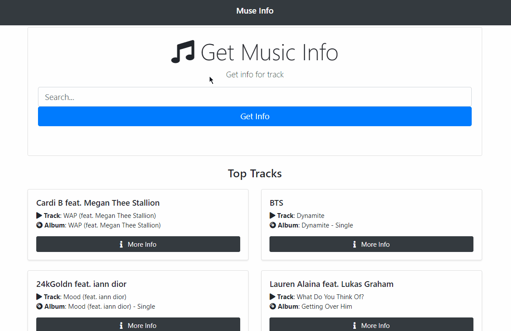

# muse-info

 Simple react based app to look up info of music/song using MusixMatch API and Bootstrap.

 Used react class components mainly to build the app.

---

---

 Based on a [Traversy Media Tutorial](https://www.youtube.com/watch?v=NDEt0KdDbhk)